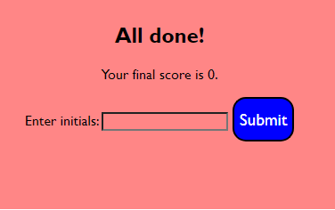
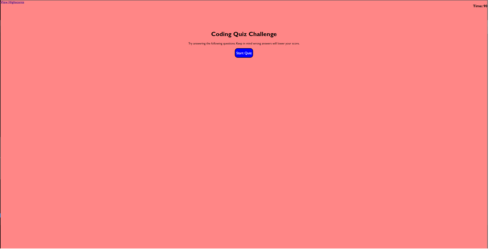
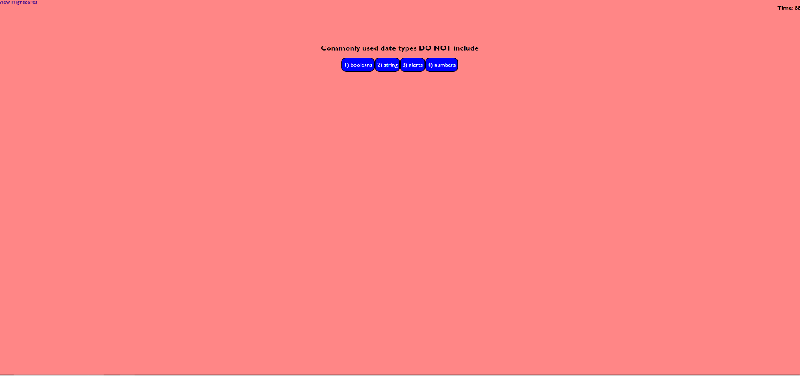
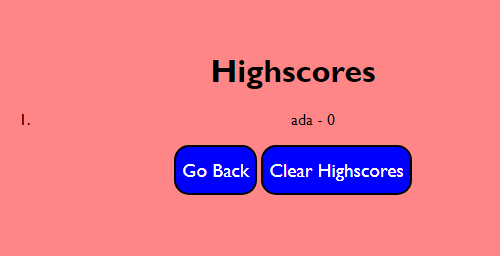

# Challenge-4-Code-Quiz
Description
My motivation for the project was to apply skills I learned to a project. This project was built to create a test where users could test their javascript knowledge, and compare their score to others with a leaderboard.

Installation
N/A

Usage

https://matt-bull1.github.io/Challenge-4-Code-Quiz/

Credits

https://www.w3schools.com/jsref/jsref_foreach.asp

https://www.youtube.com/watch?v=riDzcEQbX6k&t=1162s

https://www.w3schools.com/js/js_json_parse.asp

License
N/A
